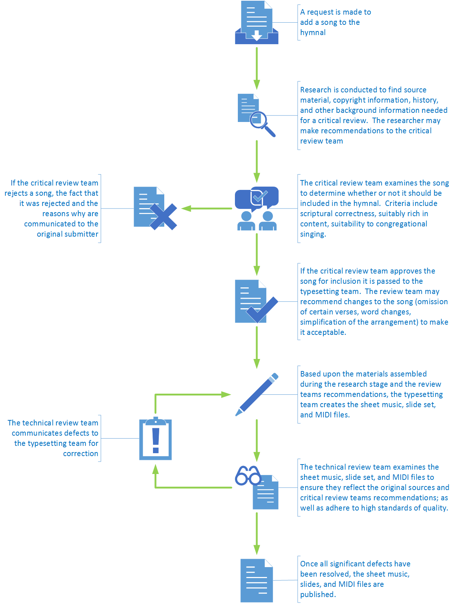

# Hymn Addition Process

The following diagram shows the basic workflow of adding a hymn to the Bumby Extras Hymnal:

## Process Steps in Detail

### Research

The research step is essentially the gathering of authoritative sources which all the following steps are based upon.  When someone suggests a song, all that is typically given is the title of the song.  But in order to use the song we need to know several things:

1. What copyrights apply to the song?  If it is a modern arrangement of an older song - would the older song that is not under copyright be suitable?
2. Is it covered under our CCLI license?  If not, can we obtain a license?  How much would that cost?  Can we get permission from the copyright holder?
3. What arrangements are available?  Will we need to make our own arrangement?
4. What is the history of the hymn?  Have verses been changed over time?  Added?  Removed?  Might we want to make our own modifications to the lyrics (restoring old verses, removing verses, changing some words)?

The researcher may make their own recommendations or not at his or her discretion.  Ultimately the job of the researcher is to assemble all this information and submit it to the critical review team to make the decision on the best path forward.

### Critical Review

The critical review team's job is to take the material collected by the researcher and decide whether to add the hymn to the hymnal or reject the hymn.

Possible reasons for rejecting the hymn include:

1. The hymn is too difficult for congregational singing
2. No SATB acapella arrangement of the song can be found, and no one can be found who is willing and able to create such an arrangement.
3. The hymn is copyrighted material, is not covered under our CCLI license; and obtaining rights to use the hymn are considered to be too expensive.
4. The song is scripturally unsound.  Modifications either cannot be made to correct the errors due to copyright restrictions.  Or the errors are so profound as to be uncorrectable.
5. The song lacks sufficient worship benefit.  It lacks depth or breadth of meaning.

The critical review team may also make recommendations on changes to the lyrics (if allowed), and which verses should be included or excluded.

### Typesetting

The process of typesetting a song is beyond the scope of this simple process document.  It involves the use of typesetting tools - specifically Lilypond and Frescobaldi - to format the music into letter sized sheet music, 4:3 format slides, and a MIDI file.

### Technical Review

The purpose of the technical review is to ensure that the typesetting faithfully transcribed the music into the various formats required and in accordance with the guidance from the critical review.  It works to ensure the following:

1. The copyright attribution is correct.  This includes licensing information.
   So if CCLI is used, that our license # is correct and the song # is correct.
3. Artist attribution is correct and complete (Composer, Poet, Arranger, etc.)
4. The Notes are correct.
5. The Words are correct.
6. The Layout looks good.
7. The music and words on the slides look big enough and are easy to read.
8. The layout is correct for where it will fit in our notebooks.

### Publishing the final results

Publishing the Sheet Music, Slides, and MIDI files involves the following steps:

1. Using Frescobaldi, produce the Sheet-Music.PDF using the Publish option.  This
   will create a high resolution Sheet-Music.pdf file and Sheet-Music.mid file.
2. Change the name of the PDF file to B-### - NAME OF SONG - Sheet Music.pdf and
   copy it to the appropriate Published subfolder.
3. Change the name of the MIDI file to B-### - NAME OF SONG.mid and copy it to
   the appropriate Published subfolder.
4. Change the name of the Slides.pdf file to B-### - NAME OF SONG - Slides.pdf and
   copy it to the appropriate Published subfolder.
5. Open the B-### - NAME OF SONG - Slides.pdf file in Acrobat.  Using the Tools
   option add a background to the first page and put the Template/Background.jpg file
   as the background.  Save the file.
6. Use the save as feature to save the file as a PNG.  That will create a set of
   PNG files with the page number appended to the name.
7. Rename the PNG files to the naming standard Presentation Creator expects; where
   verses have the name 1.1 1.2 1.3 etc. 2.1 2.2 2.3 - for the slides for verse 1,
   verse 2 etc.
8. Create the XML snippet that includes the information about the song (meter,
   copyright, verse, name, number).
9. Check in all these new files to GitHub.
10. Mark the pertinent ticket in the repository to show that the song has been
    fully added.